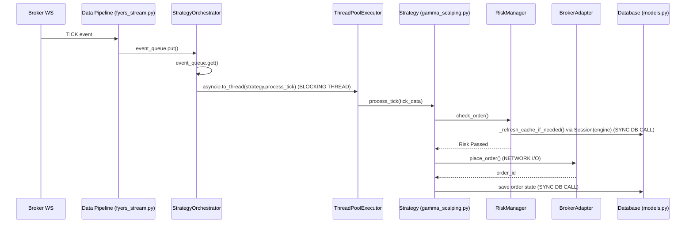

# Phase 0: Repository Cartography

## Context Overview
- **Repo root:** `/Users/nitinsinghal/Documents/project/india-trading`
- **Asset class:** Multi-leg options, Indian derivatives (equities, indices like BankNifty)
- **Exchange(s) & broker:** NSE; Brokers: Fyers, Zerodha, Dhan, AngelOne
- **Trading frequency:** Retail/Pro-Retail (intraday to short-term, atomic multi-leg basket orders)
- **Deployment:** AWS (EKS, S3 for compliance audio)

## File Inventory
- **Market Data Ingestion:** `backend/engine/data/fyers_stream.py` (referenced in progress)
- **Strategy Logic:** `backend/engine/strategies/` (`gamma_scalping.py`, `delta_hedging.py`, `institutional_dispersion.py`, `obi_hft.py`, `vix_curve.py`, etc.)
- **Signal Generation & Indicators:** `backend/engine/data/indicators.py`
- **Risk Checks:** `backend/engine/risk_manager.py`
- **Order Management (OMS) & Persistence:** `backend/models.py`, `backend/database.py`, `backend/routes/orders.py`
- **Execution/Broker Adapter:** `backend/engine/broker/` (`base.py`, `fyers_broker.py`, `zerodha_broker.py`, `dhan_broker.py`, `angel_broker.py`, `virtual.py`)
- **Position & P&L Accounting:** `backend/routes/positions.py`, `backend/routes/portfolio.py`
- **Scheduling/Orchestration:** `backend/engine/orchestrator.py`
- **API Layer:** `backend/routes/` (`main.py`, `brokers.py`, `dashboard.py`, `auth.py`, `stream.py`)
- **Frontend:** `frontend/` (Next.js 14 App Router, React Query)

## Module Dependency Graph
`fyers_stream.py` -> `orchestrator.py` -> `strategy` (e.g. `gamma_scalping.py`) -> `risk_manager.py` -> `broker` -> `database.py`

## Critical Path Trace

**Latency Bottlenecks in Critical Path:**
1. **Threadpool Contention:** `orchestrator.py:85` uses `asyncio.to_thread` for `process_tick`. If `process_tick` is CPU-bound (e.g. TA-Lib, Black-Scholes), it holds the GIL, nullifying the benefits of threading and starving the main loop of CPU cycles.
2. **Synchronous DB I/O:** `risk_manager.py:47` uses `with Session(engine) as session:` to refresh cache. This is a synchronous blocking call inside the threadpool, adding latency and potentially exhausting connections.
3. **Synchronous Broker I/O:** Depends on whether `BrokerAdapter.place_order` uses async `aiohttp` or synchronous `requests`.

## State Inventory
- **Risk Cache:** `RiskManager._cache` (`risk_manager.py:34`). Written by `_refresh_cache_if_needed`, read by `check_order`. Not protected by a `threading.Lock`, leading to potential race conditions since it's accessed via `asyncio.to_thread` from multiple strategies concurrently!
- **Orchestrator Errors:** `StrategyOrchestrator._consecutive_errors` (`orchestrator.py:59`). Mutated in the main event loop.

## External I/O Inventory
- **Database:** PostgreSQL (Supabase). Accessed via sync `sqlmodel.Session` (e.g. `risk_manager.py:47`) and async `asyncpg` (as per `progress.md`).
- **Brokers:** Zerodha, Upstox, Dhan, AngelOne via their respective SDKs (referenced in `requirements.txt`: `smartapi-python`, `dhanhq`, `kiteconnect`). These SDKs are inherently synchronous, meaning any calls to them will block the thread they run in.
